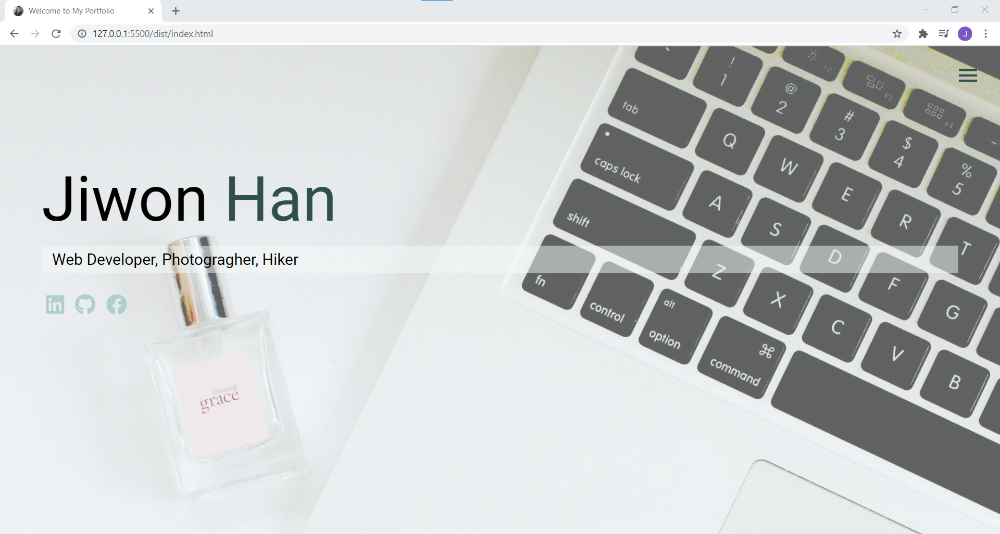
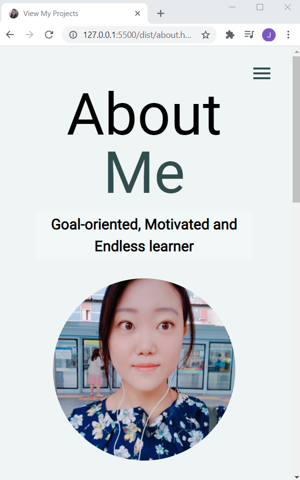

# Portfolio :blush:

#### By **Jiwon Han**

## Table of Contents

- [Introduction](#Introduction)
- [Technologies](#Technologies)
- [Contact](#Contact)
- [License](#License)

## Introduction

This is my portfolio website.

 

## Technologies

- HTML
- Vanila Javascript
- NPM
- SCSS
- Google Map

## Contact

#### Jiwon Han

- [GitHub](https://github.com/jiwon-seattle)
- [LinkedIn](https://www.linkedin.com/in/jiwon1han/)

## License

Open source software [licensed as MIT][license].

Copyright (c) 2020 **_Jiwon Han_**

[license]: https://github.com/jiwon-seattle/my-portfolio/blob/master/LICENSE.md
